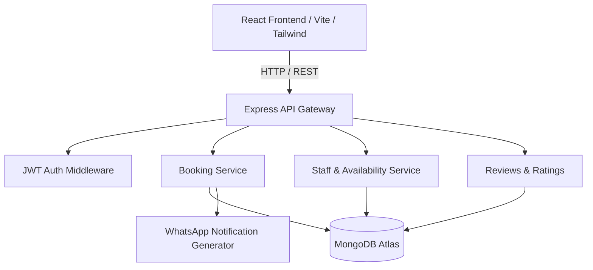

# Mayleki Studio Architecture

## Architecture Pillars
1. **Separation of Concerns**: Routes handle HTTP routing; services execute domain logic; models define persistence.
2. **Unified UI System**: Reusable common components in `Frontend/src/components/common`.
3. **Resilience & Testing**: End-to-end and API testing suite configured with automated CI.
